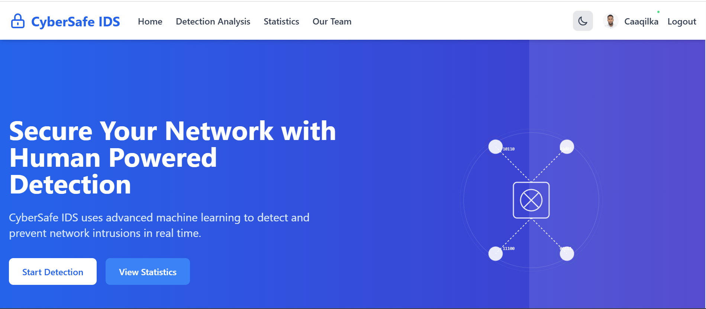
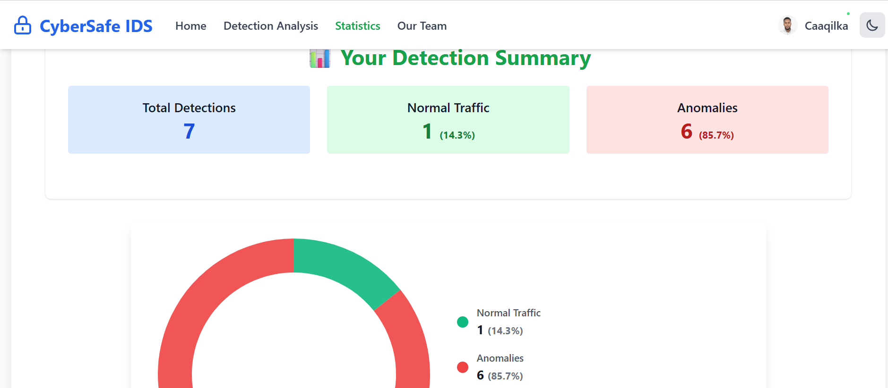

# CyberSafe IDS

**CyberSafe IDS** is an intelligent, user-friendly Intrusion Detection System that leverages machine learning to analyze network traffic and detect anomalies in real time.  
It features a modern web interface, user management, statistics, and actionable recommendations for network security.

---

## Table of Contents

- [Features](#-features)
- [Tech Stack](#-tech-stack)
- [Screenshots](#screenshots)
- [Project Structure](#-project-structure)
- [Quickstart](#-quickstart)
- [Usage](#-usage)
- [Configuration](#-configuration)
- [For Developers](#-for-developers)
- [Security Notes](#-security-notes)
- [Support](#-support)
- [License](#-license)
- [Collaborators](#collaborators)

---

## 🚀 Features

- **Real-time Network Traffic Analysis**
- **Machine Learning-based Detection** (XGBoost, 41 features)
- **User Authentication & Roles** (admin/user)
- **Detailed Statistics & Analytics**
- **Profile Management with Image Upload**
- **Dark Mode Support**
- **Responsive, Modern UI (Tailwind CSS)**
- **Actionable Security Recommendations**

## 🧰 Tech Stack

- **Python 3** (core programming language)
- **Flask** (web framework)
- **scikit-learn** (machine learning & preprocessing)
- **XGBoost** (model training)
- **MySQL** (database)
- **Tailwind CSS** (frontend styling)
- **HTML5 & Jinja2** (front end structure)
- **JavaScript** (frontend interactivity)
- **Joblib** (model serialization)
- **Werkzeug** (security, password hashing)
- **Pillow** (image processing for profile uploads)

---

## 🖼️ Screenshots

**Home Page**


_Alt: Home page showing navigation bar, hero section, and quick links._

**Statistics Page**


_Alt: Dashboard with charts and tables showing detection statistics, normal vs anomaly counts, and user activity._

**Login Page**

## 
_Alt: Login form for existing users with username and password fields._

## 🛠️ Project Structure

```
.
├── app.py
├── requirements.txt
├── models/
│   └── xgboost_best_model.pkl
├── dataset/
│   └── Train_data_Dataset.csv
├── templates/
│   ├── index.html
│   ├── predict.html
│   ├── result.html
│   ├── statistics.html
│   ├── signup.html
│   ├── login.html
│   ├── profile.html
│   └── admin_users.html
├── static/
│   ├── uploads/
│   └── images/
└── README.md
```

---

## ⚡ Quickstart

1. **Clone the repository:**
   ```bash
   git clone <your-repo-url>
   cd <your-project-folder>
   ```
2. **(Recommended) Create and activate a virtual environment:**
   - On Windows:
     ```bash
     python -m venv venv
     venv\Scripts\activate
     ```
   - On macOS/Linux:
     ```bash
     python3 -m venv venv
     source venv/bin/activate
     ```
3. **Install dependencies:**
   ```bash
   pip install -r requirements.txt
   ```
   _(All required Python packages are listed in `requirements.txt`.)_
4. **Ensure MySQL server is running.**
   - Default config: user `root`, password `''`, host `localhost`
   - Update credentials in `app.py` if needed.
5. **Place your trained model file:**
   ```
   models/xgboost_best_model.pkl
   ```
6. **Run the app:**
   ```bash
   python app.py
   ```
7. **Open your browser:**
   ```
   http://localhost:5000
   ```

---

## 📝 Usage

- **Sign up** for a new account.
- **Log in** and access the detection analysis page.
- **Fill in all 41 features** (use dropdowns for categorical fields).
- **Submit** to analyze traffic and view results.
- **View statistics** and manage your profile.

---

## ⚙️ Configuration

- **MySQL Credentials:**  
  Edit `mysql_config` in `app.py` if your MySQL user/password is different.
- **Model File:**  
  Must match the 41-feature input and label encoding as defined in `app.py`.

---

## 🧑‍💻 For Developers

- **Model Training:**  
  Use your own notebook to train and export the model as `xgboost_best_model.pkl`.
- **Feature Engineering:**  
  Ensure the order and encoding of features matches between training and `app.py`.

---

## 🛡️ Security Notes

- All user passwords are securely hashed.
- Only admins can access user management.
- All new signups are assigned the "user" role by default.

---

## 📞 Support

- Email: abdukadir.sharif@just.edu.so
- Phone: +252 617273320

---

## 📄 License

This project is for educational and research purposes.  
Contact the author for commercial or production use.

---

## 👥 Collaborators

- [**Abdikadir Sharif Mohamed**](https://github.com/caaaqil)
- [**Mohamud Mohamed Gurhan**](https://github.com/Mogurhan)
- [**Zamzam Abdulkadir Abdi**](https://github.com/sampleuser1)
- [**Shaafi'e Abdillahi Hussein**](https://github.com/sampleuser2)
